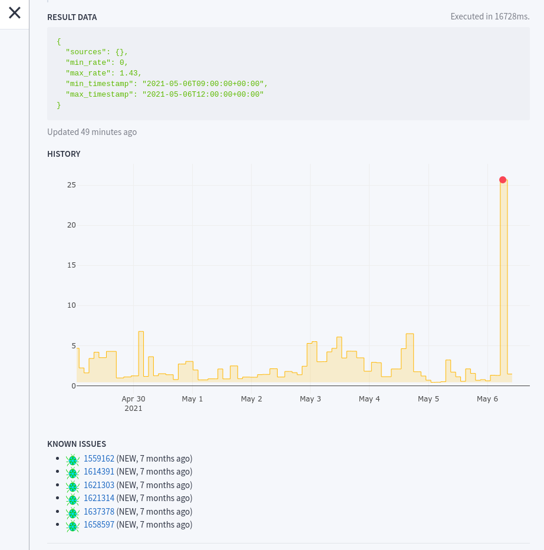

# Telescope


*Telescope* is a small Web app that will act as a proxy between a monitoring service — like GCP uptime checks, Pingdom, or [Upptime](https://upptime.js.org/) — and a series of domain specific checks for your infrastructure.


## Usage

Every check defined in your configuration file is exposed as an endpoint that returns `200` if successful or `5XX` otherwise:

```http
GET /checks/{a-project}/{a-check}

HTTP/1.1 200 OK
Content-Length: 260
Content-Type: application/json; charset=utf-8
Date: Fri, 16 Aug 2019 13:29:55 GMT
Server: Python/3.7 aiohttp/3.5.4

{
    "name": "a-check",
    "project": "a-project",
    "url": "/checks/a-project/a-check",
    "module": "checks.core.heartbeat",
    "documentation": "URL should return a 200 response.",
    "description": "Some check description.",
    "success": true,
    "parameters": {},
    "data": {
        "ok": true
    }
}

```

The response has some additional `"data"`, specific to each type of check.

Cache can be forced to be refreshed with the ``?refresh={s3cr3t}`` querystring. See ``REFRESH_SECRET`` in *Server configuration* section.

### Other endpoints:

* ``/checks``: list all checks, without executing them.
* ``/checks/{a-project}``: execute all checks of project ``a-project``
* ``/checks/tags/{a-tag}``: execute all checks with tag ``a-tag``
* ``/checks/tags/{tag1}+{tag2}``: execute all checks having both tags ``tag1`` and ``tag2``

Output format:

* Request header ``Accept: plain/text``: renders the check(s) as a human readable table.


## Checks

The checks are defined in a `config.toml` file, and their module must be available in the current `PYTHONPATH`:

```toml
[checks.a-project.a-check]
description = "Heartbeat of the public read-only instance."
module = "checks.core.heartbeat"
params.url = "https://firefox.settings.services.mozilla.com/v1/__heartbeat__"

[checks.remotesettings-uptake-release.global-error-rate]
description = "Global sync status"
module = "checks.remotesettings.uptake_error_rate"
params.max_error_percentage = 2
params.sources = ["settings-sync"]
params.channels = ["release", "esr"]
params.period_hours = 3
ttl = 7200
tags = ["telemetry", "remotesettings"]
```

* `description`: Some details about this check
* `module`: Path to Python module
* `params`: (*optional*) Parameters specific to the check
* `ttl`: (*optional*) Cache the check result for a number of seconds
* `tags`: (*optional*) List of strings allowing grouping of checks at `/tags/{tag}`


### Environment variables

The config file values can refer to environment variables (eg. secrets) using the ``${}`` syntax.

```toml
[checks.myproject.mycheck]
module = "checks.remotesettings.collections_consistency"
params.url = "http://${ENV_NAME}.service.org"
params.auth = "Bearer ${AUTH}"
```


### Built-In Checks

See the [built-in checks](checks) in the source tree.


### Custom Check

Checks are simple Python files:

```py
# mychecks/can_deploy.py
"""
Checks whether one can deploy to production.
"""
import datetime

from telescope.typings import CheckResult


async def run(forbidden_day: str = "fri") -> CheckResult:
    day_of_week = datetime.date.today().strftime("%a").lower()
    if day_of_week == forbidden_day:
        return False, {"reason": "wrong day"}
    return True, {}
```

The module docstring is used as the check documentation, and the `params` of the config are passed as arguments to `run()`:

```toml
[checks.myproject.can-deploy]
description = "Deployment window"
module = "can_deploy"
params.forbidden_day = "fri"
```


## Run Web App Locally

Using Docker, and a local config file:

```
docker run -p 8000:8000 -v `pwd`/config.toml:/app/config.toml mozilla/telescope
```

Or from source (*requires Python 3.10+ and uv*):

```
make start
```

### Web UI

A minimalist Web page is accessible at ``/html/index.html`` and shows every check status,
along with the returned data and documentation.

A SVG diagram can be shown in the UI (see ``DIAGRAM_FILE``). Elements of the SVG diagram will be turned red or green based on check results.
Set the ``id`` attribute of relevant diagram elements to ``${project}--${name}`` (eg. ``remotesettings-uptake--error-rate``) and the app will toggle the ``fill`` attribute.


### Container and local content

To load your custom checks and diagram, everything has to be mounted in the container:

```
docker run \
    -p 8000:8000 \
    -v `pwd`/config.toml:/app/config.toml \
    -v `pwd`/mydiagram.svg:/app/diagram.svg \
    -v `pwd`/mychecks:/app/mychecks \
    -e PYTHONPATH=/app/mychecks \
    mozilla/telescope
```


## Command Line

You can execute checks from the command-line.

Using Docker, and a local config file:

```
docker run -v `pwd`/config.toml:/app/config.toml mozilla/telescope check

docker run -v `pwd`/config.toml:/app/config.toml mozilla/telescope check myproject

docker run -v `pwd`/config.toml:/app/config.toml mozilla/telescope check myproject mycheck
```

Or from source (*requires Python 3.10+ and uv*):

```
make check

make check project=myproject

make check project=myproject check=mycheck
```

Return codes:

- `0`: all checks were successful
- `1`: some check failed
- `2`: some check crashed (ie. Python exception)


## Advanced

### History

For checks that return scalar values, the history of past values can be retrieved.

To accomplish that, *telescope* will query its own server logs and look for past execution results.



In order to enable history for a certain check, the module must define a `DEFAULT_PLOT` constant (or the check must have a `plot` setting in the config file), which refers to the field that has to be read from the check results details.

History is disabled by default, and requires ``HISTORY_DAYS`` and ``HISTORY_PROJECT_ID`` to be set (see *Server configuration* section).

### Bug tracker integration

A list of known issues or bug tickets can be associated and shown on check details (set ``BUGTRACKER_URL`` to an empty string to disable).

The default implementation is for Bugzilla, and retrieves the bugs which have a certain string in their ``whiteboard`` field.

For example, if the configured ``SERVICE_NAME`` is ``delivery-checks`` and ``ENV_NAME`` is ``prod``, the bugs for the check ``server/heartbeat`` should have ``delivery-checks prod server/heartbeat`` in their ``whiteboard`` field to be listed.

If the bugs are only readable by authenticated users, then set ``BUGTRACKER_API_KEY`` to retrieve them all.
Note that for security bugs only bug IDs are shown, summaries will be empty.


### Server configuration

Server configuration is done via environment variables:

* ``CONFIG_FILE``: Path to configuration file (default: ``"config.toml"``)
* ``CONTACT_EMAIL``: Contact email for this instance (default: ``postmaster@localhost``)
* ``DIAGRAM_FILE``: Path to SVG diagram file (default: ``"diagram.svg"``)
* ``CORS_ORIGIN``: Allowed requests origins (default: ``*``)
* ``ENV_NAME``: A string to identify the current environment name like ``"prod"`` or ``"stage"`` (default: None)
* ``HOST``: Bind to host (default: ``"localhost"``)
* ``PORT``: Listen on port (default: ``8000``)
* ``DEFAULT_TTL``: Default TTL for endpoints in seconds (default: ``60``)
* ``DEFAULT_REQUEST_HEADERS``: Default headers sent in every HTTP requests, as JSON dict format (example: ``{"Allow-Access": "CDN"}``, default: ``{}``)
* ``LOG_LEVEL``: One of ``DEBUG``, ``INFO``, ``WARNING``, ``ERROR``, ``CRITICAL`` (default: ``INFO``)
* ``LOG_FORMAT``: Set to ``text`` for human-readable logs (default: ``json``)
* ``VERSION_FILE``: Path to version JSON file (default: ``"version.json"``)
* ``REFRESH_SECRET``: Secret to allow forcing cache refresh via querystring (default: ``""``)
* ``REQUESTS_TIMEOUT_SECONDS``: Timeout in seconds for HTTP requests (default: ``5``)
* ``REQUESTS_MAX_RETRIES``: Number of retries for HTTP requests (default: ``4``)
* ``SENTRY_DSN``: Report errors to the specified Sentry ``"https://<key>@sentry.io/<project>"`` (default: disabled)
* ``SERVICE_NAME``: Name of the running service, used to link known issues in bug tracker (default: ``telescope``)
* ``SERVICE_TITLE``: Title shown in the UI (default: capitalized service name)
* ``HISTORY_PROJECT_ID``: ID of GCP project that historic data can be fetched from, should make telescope's logs available through BigQuery (default: None)

* ``BUGTRACKER_URL``: Bug tracker URL. Set to empty string to disable. (default: ``https://bugzilla.mozilla.org``)
* ``BUGTRACKER_API_KEY``: Bug tracker API key to fetch non-public bugs (default: none)
* ``BUGTRACKER_TTL``: Default TTL for endpoints in seconds (default: ``3600``)

* ``HISTORY_DAYS``: Number of days to cover when fetching history of checks (default: 0, disabled)
* ``HISTORY_TTL``: Default TTL for history refresh in seconds (default: ``3600``)

* ``GITHUB_TOKEN``: Github [Personal Access Token value](https://github.com/settings/tokens) to avoid rate-limiting (default: disabled)
* ``GOOGLE_APPLICATION_CREDENTIALS``: Absolute path to credentials file for BigQuery authentication (eg. `` `pwd`/key.json``, default: disabled)
* ``CURL_BINARY_PATH``: path to ``curl`` command (default: ``curl``)
* ``TROUBLESHOOTING_LINK_TEMPLATE``: Pattern for troubleshooting links, with `{project}` and `{check}` placeholders (default: ``https://wiki.example.com/troubleshooting.html#{project}/{check}``)
* ``REDIS_CACHE_URL``: URL of the Redis server to use for caching (eg. ``redis://localhost:6379/0``, default: disabled)
* ``REDIS_KEY_PREFIX``: Prefix to use for Redis keys (default: ``telescope:``)
* ``CACHE_LOCK_ENABLED``: Enable distributed locks to avoid running the same check in parallel (default: ``true``)
* ``LIMIT_WORKER_CONCURRENCY``: Maximum number of parallel HTTP requests (default: ``8``)
* ``LIMIT_REQUEST_CONCURRENCY``: Maximum number of parallel worker tasks (default: ``32``)

Configuration can be stored in a ``.env`` file:

```
LOG_LEVEL=debug
# Disable JSON logs
LOG_FORMAT=text
```

## Tests

```
make tests
```

Or add `pytest` options:

```
PYTEST_ADDOPTS="--last-failed -vv" make test
```

Or run `pytest` through `uv` to pass arguments:

```
uv run pytest -s -k log
```

## License

*Telescope* is licensed under the MPLv2. See the `LICENSE` file for details.
