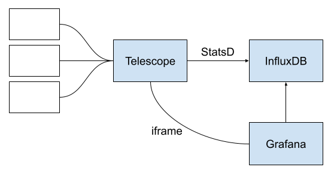
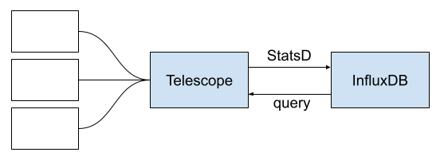
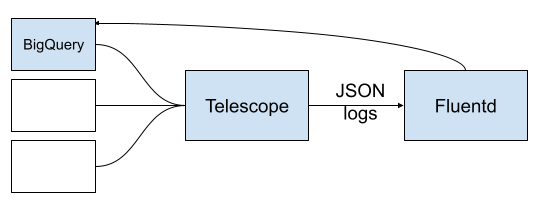

# Add History of Checks

- Status: accepted
- Date: 2020-11-18

Tracking issue: https://github.com/mozilla-services/telescope/pull/610

## Context and Problem Statement

We chose a stateless design to maintain complexity as low as possible. It has no database, just an in-memory cache. Simpler and more robust.

«*We don't want Telescope to become a new source of problems*»

The unified visualization of checks was already helping us reduce legwork for troubleshooting. However, the application lacks the ability to see health behavior over time. When a check is failing it is somehow difficult to know whether it failed in the past, how often it fails, or what is the history of the observed topic.

- We want to visualize the history of a check.
- We don’t want to have to open another tool (all in same UI)
- We want to keep Telescope publicly accessible (no login)

## Decision Drivers

In order to choose our solution we considered the following criteria:

- **Complexity**: Low → High: how much additional complexity
- **Visualization**: Limited → Advanced: how powerful can be the timeline visualization
- **Cost**: Low → High: how much effort does the solution represent

## Considered Options

1. Send check values with StatsD & visualize with Grafana
2. Send check values with StatsD & custom visualization
3. Send check values from structured logs & custom visualization

## Decision Outcome

Chosen option: option 3, because it does not increase complexity. Visualization features are good enough, cost is low. Piggybacking the lower layers of our cloud architecture, such as logs, gives us a lot of robustness and durability.

## Pros and Cons of the Options

### Option 1 - Send check values with StatsD & visualize with Grafana

With this solution, we send values using StatsD on each check execution.

Our existing InfluxDB infrastructure is in charge of the data collection, and visualization is done via Grafana. We would use the embedding (iframes) features to incorporate the history graphs in our UI.

**Complexity**

Low for data collection: StatsD is lightweight and sending scalars (gauges) is simple. Plus, InfluxDB is already in place.

High for visualization deployment: Grafana requires authentication, and embedding iframes in a publicly accessible tool is not possible. Possible solutions to bypass this limitation would all introduce complexity (dedicated Grafana instance, proxies, ...).

**Visualization**

Advanced: Grafana offers one of the best timeline visualizations.

**Cost**

Medium: Introducing a StatsD client in the codebase is close to zero. However, the Grafana embedding approach will require some coordination with the operations team to deploy and configure publicly accessible graphs, without jeopardizing the security of our existing monitoring platform.
Each check graph to embedded would have to be explicitly defined in advance in Grafana, increasing the setup cost significantly.

### Option 2 - Send check values with StatsD & custom visualization

Same as 1), we use StatsD for data collection.
But with this solution, Telescope would query InfluxDB directly, and serve the history of past values as JSON to the UI.
A custom chart visualization widget, powered by a JavaScript charting library like Plotly, would consume this simple data and plot the history.

**Complexity**

Low for data collection: See solution A).

Low/Medium complexity for visualization: introduce an InfluxDB client in Telescope, with the right credentials, process queries, and serve results.
We consider that adding a visualization widget in the UI does not introduce complexity to the architecture.

**Visualization**

Limited: an ad-hoc visualization widget would have limited user interactions, and would only leverage a tiny subset of InfluxDB aggregation and time navigation features.

**Cost**

Medium: InfluxDB is currently not accessible by other systems like Telescope. The operations team would have to set up and secure an access to the collected data.
With limited interactions and options, the implementation of a sparkline widget to plot scalar values over time is close to zero.

### Option 3 - Send check values from structured logs & custom visualization

With this solution, we «piggyback» the current structured logging system that is already in place to send values.
On each check execution, the result is logged with a timestamp, like any other application log message, and our log aggregator (FluentD) sends it to our data warehouse (BigQuery). The same repository as our client telemetry.

Like for 2), a custom chart visualization widget would consume this simple data and plot the history.

**Complexity**

Zero additional complexity: sending values consists in adding an annotated log message, a one liner. Plus Telescope is already integrated with BigQuery, querying past values consists of adding a few lines of SQL.
Like for 2), no extra complexity for the UI part.

**Visualization**

Limited: See 2).

**Cost**

Close to zero: the operations team would just have to give access on the existing log BigQuery table to the existing Telescope user. Cost of the UI implementation is close to zero, like for 2)
